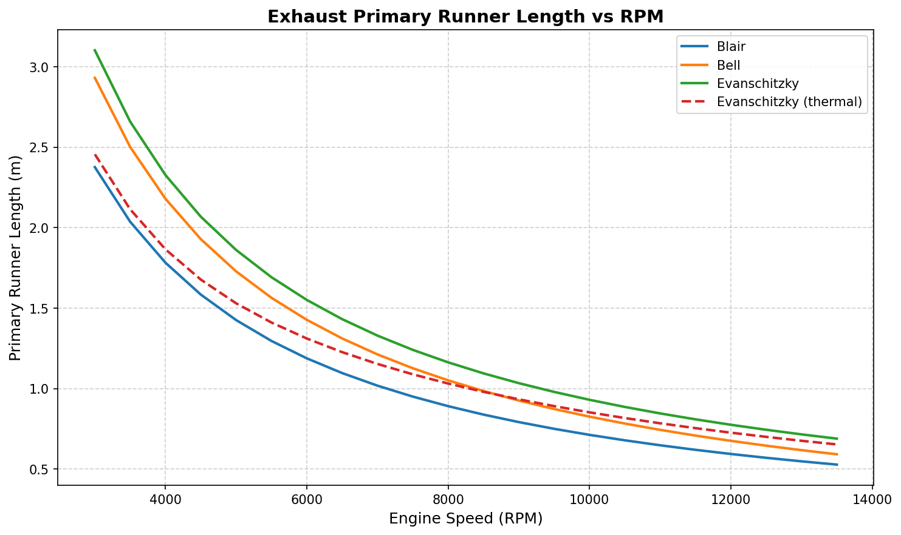

# Exhaust Runner Length Optimizer

A 1D acoustic model for optimizing exhaust primary runner length across an engine's RPM range, based on exhaust pressure wave tuning theory.

Implements and compares three methods from literature: Blair (1999), Bell (2006), and a first-principles wave mechanics approach with optional temperature correction along the runner.



---

## Background

When the exhaust valve opens, a pressure wave travels down the runner toward the collector. If the pipe length is tuned correctly, the returning low-pressure reflection arrives back at the valve during the overlap period. This allows for scavenging of residual gases and improves volumetric efficiency, hence boosting power. The optimal length is RPM-dependent, which is why exhaust systems are tuned for a target power band.

---

## Methods

| Method | Approach | Temperature |
|---|---|---|
| Blair (1999) | Empirical | Constant at port |
| Bell (2006) | Empirical, valve-timing dependent | Constant at port |
| Evanschitzky | Wave mechanics, first principles | Constant at port |
| Evanschitzky Thermal | Wave mechanics, first principles | Iterative, accounts for cooling along runner |

---

## Usage

Install dependencies:
```bash
pip install -r requirements.txt
```

Run with default config:
```bash
python main.py
```

Run with a custom config or output directory:
```bash
python main.py --config config/engine_config.yaml --output outputs/
```

Suppress the plot window (useful on servers):
```bash
python main.py --no-plot
```

Run a sensitivity study on all formulas:
```bash
python main.py --sensitivity
```
---

## Configuration

All engine parameters are set in `config/engine_config.yaml`:

No code changes needed to model a different engine — edit the YAML and rerun.
